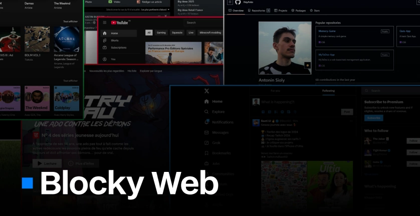

# Blocky Web

## About

Blocky Web is a browser extension that brings back the aesthetic of early web design by replacing modern rounded elements with clean, sharp edges.

**Features:**

- Forces square edges by removing all border-radius
- Optional animation disabling
- Blacklist to exclude specific websites when needed
- Global toggle from the popup

Works across \*any\* websites.

## Installation (Dev)

### Firefox

1. Open `about:debugging`.
2. Click **This Firefox**.
3. Click **Load Temporary Add-on**.
4. Select the project's `manifest.json` file.
